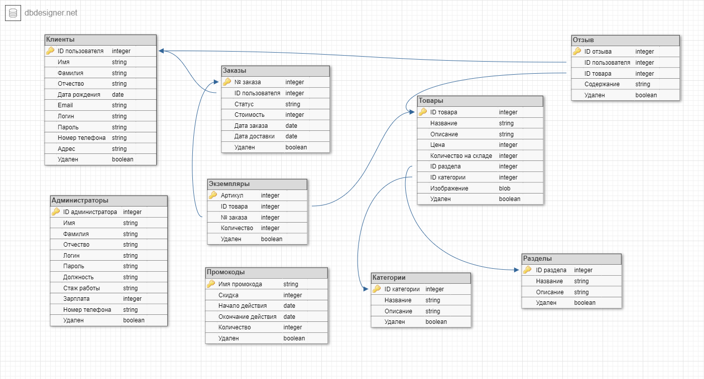
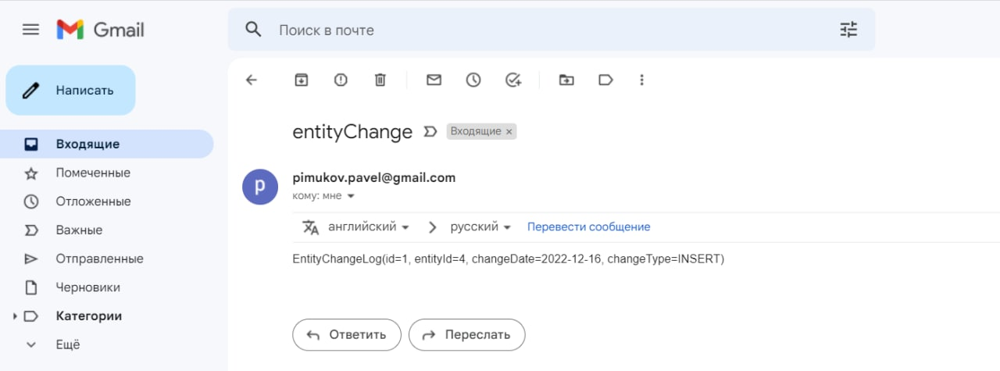

# ESA Lab2-3
## Practice work №2
### Application using Spring Framework
Made by students of 6133-010402D: \
**Pimukov Pavel** and **Irina Uraltseva**

Our project is about web app of online store "Geek shop"

### DB part
Here is structure of database (is the same as in Lab1):

Web views of web-app are also the same.

Основной поинт второй лабораторной - перевод первой лабы на JavaEE на Spring (Boot).
Для этого было необходимо:
1) Заново создать проект, только уже используя спринг initializer(т.к. так удобнее),
подключить все необходимые зависимости - Spring JPA, MVC , BOOT + остальные зависимости
2) Реализация data layer с entity не меняется, единственное - меняем место откуда импортим репозитории,
так как теперь мы работаем с Hibernate через обертку Spring JPA. 
так же настройка spring.jpa.hibernate.naming.physical-strategy=org.hibernate.boot.model.naming.PhysicalNamingStrategyStandardImpl
понадобилась по той причине, что спринт до дефолту переопределяет именование полей в entity и не обращает
внимание на параметр name в аннотации Column
3) Настройки подключения к бд полностью переходя в application.properties
4) Все EJB аннотации заменяем на аннотации спринга для работы с бинами
5) Так же, т.к. для реализации UI используются JSP файлы, то не обходимо переопределять
версию tomcat которую будет использовать спринг, т.к. по дефолту он не умеет в JSP файлы (их много и переделывать все лень)
берем tomcat-embed-jasper

Основной поинт третьей лабы - рест сервисы с различными produces типами (JSON, XML)
Для этого добавил несколько эндпоинтов по заказам и категориям, выгружающие и возвращающие данные в 
том или ином форматах. Так же, для работы с xsl страницами, пришлось дописывать отдельную конфигурию на ModelView
конфиг можно увидеть в мейн классе - EsaLab2Application.

Касательно технологий JAX-RS и Spring Rest,
JAX-RS - спецификация, предоставляет нам рад абстракций, чтобы скрыть ряд лоу левел операций
в клиент серверном взаимодействии, для использования аннотаций необходимо взять конктную реализацию 
данной спеки - например Jackson
Spring Rest - вообще тяжело рассматривать отдельно, т.к. идет чаще всего вместо со всем Spring MVC
Предоставляет примерно тоже самое что и JAX-RS, с той разницей, что Spring Rest - уже реализация,
и так же Spring Rest - часть спринговой экосистемы, значит хорошо интегрируется с другими Spring модулями
например : Spring Security, AOP и т.д.

Пример отправки email в 4ой лабораторной

